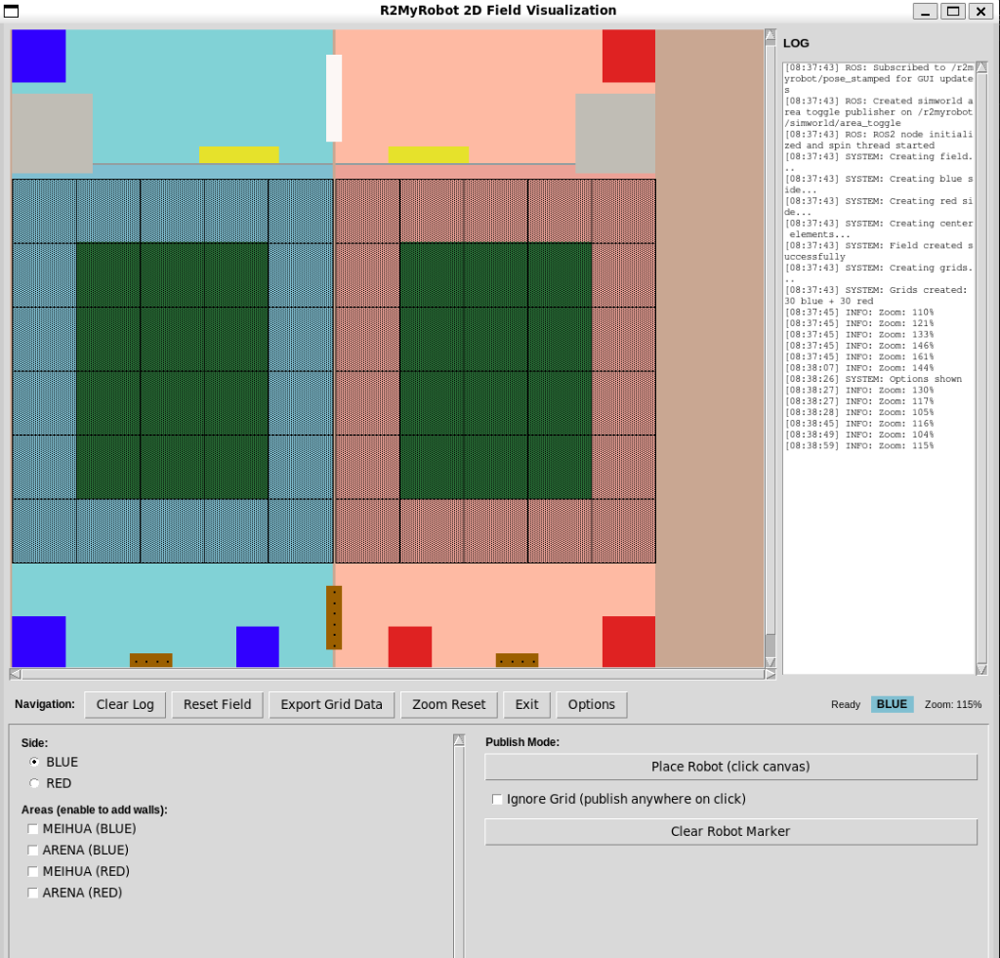
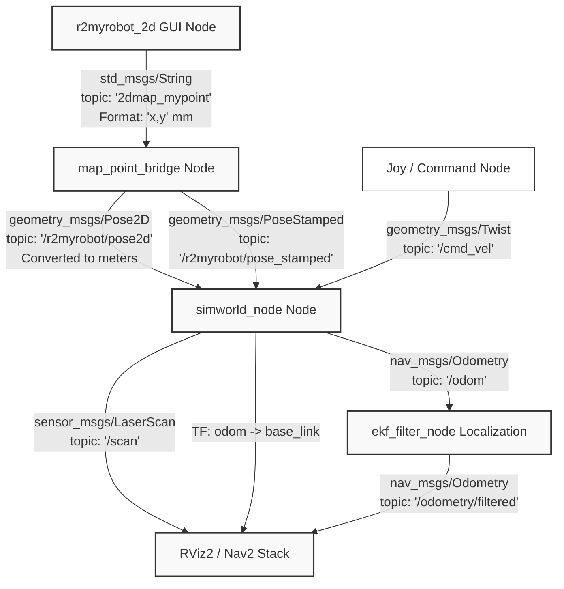
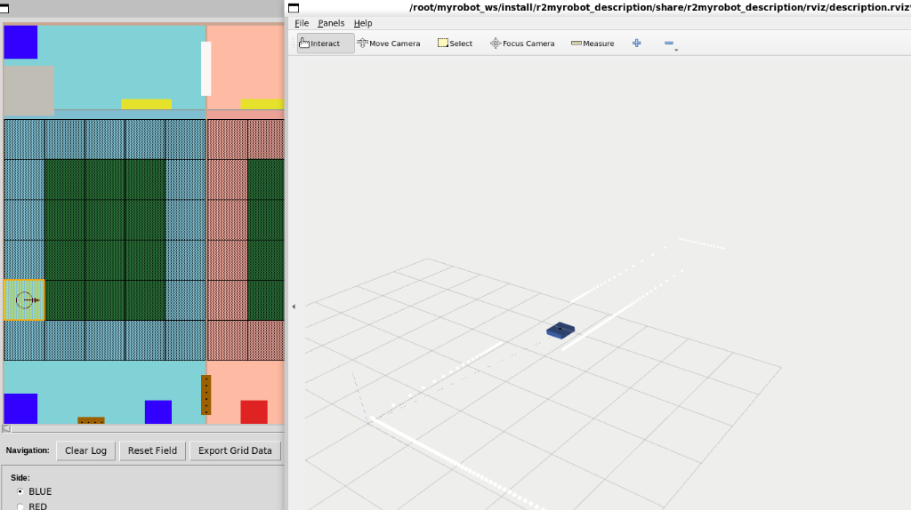

# r2myrobot — ROS 2 Workspace

Repository ini berisi workspace ROS 2 untuk pengembangan robot KRAI 2026. Workspace ini mencakup visualisasi GUI 2D, simulator 2D ringan, deskripsi robot (URDF), simulasi Gazebo, hingga modul navigasi dan *bringup* hardware.

Sebagai informasi, repositori ini diatur sebagai **multi-package workspace** dengan package **`r2myrobot`** bertindak sebagai **Metapackage** (package tanpa source code utama yang berfungsi mengelompokkan dependensi paket-paket lainnya).

---

## Fitur Utama

### 1. GUI Lapangan 2D (`r2myrobot_2d`)
Antarmuka GUI berbasis Tkinter untuk memvisualisasikan lapangan pertandingan robot dengan spesifikasi grid sesuai appendix ukuran lapangan ABU ROBOCON 2026.



*   **Dual-Side Layout**: Representasi Sisi Biru dan Sisi Merah dengan dimensi total 12100 x 12150 mm.
*   **Interactive Grid**: Grid berukuran 1200 x 1200 mm (5x6 cell per sisi) yang interaktif. Klik pada grid akan menampilkan koordinat pusat $(x, y)$ dalam milimeter dan mentransmisikan data ke ROS 2.
*   **ROS 2 Publisher**: Mengirimkan data titik koordinat terklik secara real-time.
*   **Log Panel**: Panel informasi aktivitas sistem, log ROS, dan event klik grid.

### 2. Deskripsi & Simulasi Robot (`r2myrobot_description` & `r2myrobot_simworld`)
*   **URDF Model (`r2myrobot_description`)**: Definisi model fisik robot (base berukuran $0.4 \times 0.4$ m, massa 2 kg) beserta link sensor LIDAR dalam format Xacro.
*   **Lightweight 2D Simulator (`r2myrobot_simworld`)**: Simulator 2D untuk memproses raycasting LIDAR, kalkulasi odometry robot, serta melakukan broadcast TF (`odom` -> `base_link`). Cocok untuk pengujian cepat tanpa beban komputasi tinggi.
*   **Gazebo Simulation (`r2myrobot_gazebo`)**: Integrasi dengan simulator Gazebo 3D menggunakan world dan mesh robot yang nyata untuk uji coba fisik 3D.

### 3. Navigasi & Lokalisasi (`r2myrobot_navigation` & `r2myrobot_base`)
*   **EKF Localization (`r2myrobot_base`)**: Konfigurasi filter EKF (`robot_localization`) untuk estimasi posisi robot dengan menggabungkan data sensor.
*   **SLAM & Nav2 (`r2myrobot_navigation`)**: Konfigurasi Nav2 stack dan RViz untuk pemetaan serta perencanaan jalur (*path planning*).

---

## Aliran Data & Komunikasi Node (ROS 2 Topics)

Berikut adalah diagram alur data antar node di dalam workspace ini:



### Topik Utama:
*   **`2dmap_mypoint`** (`std_msgs/String`): Koordinat hasil input/klik dari GUI lapangan (format: `"x,y"` dalam mm, contoh `"3225,5525"`).
*   **`/r2myrobot/pose2d`** (`geometry_msgs/Pose2D`): Koordinat target dalam meter setelah diproses oleh `map_point_bridge`.
*   **`/scan`** (`sensor_msgs/LaserScan`): Data sensor jarak LIDAR hasil raycasting simulasi.
*   **`/odom`** (`nav_msgs/Odometry`): Estimasi posisi robot dari roda/simulator.
*   **`/r2myrobot/simworld/area_toggle`** (`std_msgs/String`): Sinyal toggle area dinamis lapangan (seperti area MEIHUA atau ARENA) dari GUI ke simulator.

---

## Langkah Menjalankan (Quick Start)

### 1. Build Workspace
Masukkan repositori ini ke dalam direktori `src` workspace ROS 2 Anda, lalu jalankan perintah build:
```bash
cd ~/myrobot_ws
colcon build --symlink-install
source install/setup.bash
```

### 2. Menjalankan GUI Lapangan 2D
```bash
# Melalui executable command
ros2 run r2myrobot_2d r2myrobot_2d_gui

# Atau jalankan script python secara langsung
python3 src/r2myrobot_2d/r2myrobot_2d/main.py
```

### 3. Menjalankan Simulator & Bridge
Buka terminal baru, source workspace Anda, lalu jalankan simulator dan node jembatan koordinat:
```bash
# Terminal 2: Simulator
ros2 run r2myrobot_simworld simworld_node

# Terminal 3: Bridge
ros2 run r2myrobot_simworld map_point_bridge
```

### 4. Menjalankan Demo Simulasi Interaktif & RViz (Dijalankan Bersama)
Untuk melihat visualisasi lapangan 2D berdampingan dengan model robot serta sensor laser scan di RViz, jalankan kedua launch file berikut di terminal terpisah secara bersamaan:

*   **Terminal 1 (Simulator & GUI Demo)**:
    ```bash
    ros2 launch r2myrobot_simworld demo.launch.py use_demo_pose:=false
    ```
*   **Terminal 2 (Visualisasi RViz)**:
    ```bash
    ros2 launch r2myrobot_description visualize.launch.py
    ```



Ketika Anda melakukan klik titik koordinat pada GUI lapangan (sisi kiri), model robot dan persebaran sensor LIDAR (laser scan) akan langsung ter-update di RViz (sisi kanan).

### 5. Hardware Bringup (Robot Asli)
Untuk meluncurkan seluruh konfigurasi base hardware, sensor, dan micro-ROS agent pada robot asli:
```bash
ros2 launch r2myrobot_bringup bringup.launch.py
```
*(Gunakan script helper `./update_microros.bash` untuk mempermudah update dependensi micro-ROS agent di workspace).*

---

## Daftar Package (Package Directory)

Berikut adalah pembagian tugas untuk setiap direktori di workspace ini:
*   [`r2myrobot`](./r2myrobot): Metapackage utama pembungkus dependensi.
*   [`r2myrobot_2d`](./r2myrobot_2d): Kode sumber GUI lapangan interaktif berbasis Tkinter.
*   [`r2myrobot_simworld`](./r2myrobot_simworld): Simulator 2D ringan dan bridge data koordinat.
*   [`r2myrobot_description`](./r2myrobot_description): Deskripsi robot (Xacro/URDF) dan konfigurasi visualisasi RViz2.
*   [`r2myrobot_gazebo`](./r2myrobot_gazebo): Konfigurasi simulasi 3D menggunakan Gazebo.
*   [`r2myrobot_navigation`](./r2myrobot_navigation): Konfigurasi navigasi otonom menggunakan Nav2 stack.
*   [`r2myrobot_base`](./r2myrobot_base): Konfigurasi dasar sensor dan sensor fusion (EKF).
*   [`r2myrobot_bringup`](./r2myrobot_bringup): Launch files utama untuk mengaktifkan seluruh subsistem robot.
