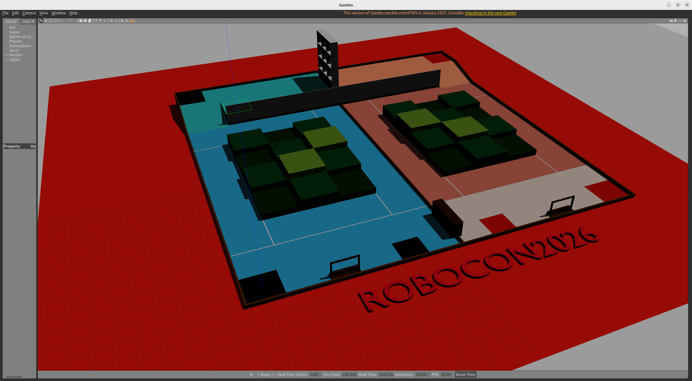

# Robocon 2026 Gazebo Simulation

Robocon 2026 比赛场地的 Gazebo 仿真环境功能包。



## 功能介绍

本功能包提供 Robocon 2026 比赛场地的 Gazebo 仿真模型，可用于机器人导航、路径规划等算法的开发与测试。

## 依赖

- ROS 2
- Gazebo
- gazebo_ros
- robot_state_publisher
- xacro

## 文件结构

```
robocon2026_gazebo_simulation/
├── CMakeLists.txt
├── package.xml
├── LICENSE
├── README.md
├── launch/
│   └── gazeboTest.launch.py    # Gazebo仿真启动文件
├── meshes/
│   ├── robocon2026.glb         # 场地模型 (GLB格式)
│   ├── robocon2026.mtl         # 材质文件
│   ├── robocon2026.obj         # 场地模型 (OBJ格式)
│   └── robocon2026.stl         # 场地模型 (STL格式)
├── urdf/
│   └── map/
│       └── rcmap.xacro         # 场地URDF描述文件
├── worlds/
│   └── empty.world             # Gazebo世界文件
└── images/
    └── Snipaste_2026-01-14_22-01-46.png
```

## 使用方法

### 编译

```bash
colcon build --packages-select robocon2026_gazebo_simulation
source install/setup.bash
```

### 启动仿真

```bash
ros2 launch robocon2026_gazebo_simulation gazeboTest.launch.py
```

## 许可证

Apache-2.0

## 特别鸣谢

本项目场地模型来源于 [Kuriharamio/RC2026_SIM](https://github.com/Kuriharamio/RC2026_SIM)，感谢原作者的贡献！
